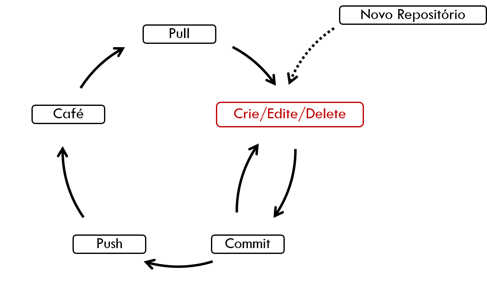

```{r, child="00-preamble.Rmd"}

```


# Sumário

1. [Sobre a Curso-R](#sobre-curso-r)

1. [Sobre o curso](#sobre-o-curso)

1. [Preparando o ambiente de desenvolvimento](#preparando-o-ambiente)

1. [Fundamentos de desenvolvimento de pacotes em R](#fundamentos-pacote)

1. [Documentação](#documentacao)

1. [Testes unitários e consistência de código](#testes-unitarios)

1. [Disponibilizando seu pacote](#disponibilizando-o-pacote)

---
class: middle, center
name: sobre-curso-r

# Sobre a Curso-R

---

class: middle, center

## A empresa

.pull-left[
```{r, echo = FALSE}
knitr::include_graphics("https://d33wubrfki0l68.cloudfront.net/295643c6243701ae6a9bac3fb8ad467ff0ce3c84/d1785/img/logo/cursor1-41.png")
```

<br>
<br>

```{r, echo = FALSE}
knitr::include_graphics("img/logo_r6.png")
```

]

.pull-right[
```{r, echo = FALSE, out.width="90%"}
knitr::include_graphics("img/produtos.png")
```
]

**[www.curso-r.com](https://www.curso-r.com)**

---

## Ministrantes

.pull-left[

### Caio Lente

```{r, echo=FALSE, out.width="30%"}

```

Mestrando em Ciência da Computação no IME-USP e cientista de dados na Terranova Consultoria. Programador desde os 15 anos, começou a se apaixonar pelo R em 2016 e agora não fala em outra coisa. Metido a designer, maníaco da organização e metade texano.

]


.pull-right[

### Beatriz Milz

```{r, echo=FALSE, out.width="30%"}
knitr::include_graphics("img/bea.jpg")
```

Doutoranda em Ciência Ambiental (PROCAM/IEE/USP) na Universidade de São Paulo. Co-organizadora da [R-Ladies São Paulo](https://www.meetup.com/R-Ladies-Sao-Paulo/). Instrutora da [Carpentries](https://carpentries.org/instructors/), um projeto que tem como missão ensinar habilidades de ciência de dados para pessoas pesquisadoras. Instrutora de tidyverse [certificada pela RStudio](https://education.rstudio.com/trainers/people/milz+beatriz/). 


]

---

## Linha do tempo


```{r, echo=FALSE, out.width="40%"}
knitr::include_graphics("img/linha_do_tempo.png")
```


---

## Nossos cursos


.pull-left[
<div class="container center">
  <div class="card">
    <h2>Programação em R</h2>
    <hr style = "background-color: #3bb44a;"/>
    <p><a href = "https://www.curso-r.com/cursos/intro-programacao/">Introdução à programação com R</a></p>
    <p><a href = "https://www.curso-r.com/cursos/r4ds-1/">R para Ciência de dados I</a></p>
    <p><a href = "https://www.curso-r.com/cursos/r4ds-2/">R para Ciência de dados II</a></p>
    <p><a href = "https://www.curso-r.com/cursos/pacotes/">Pacotes</a></p>
    <p><a href = "https://www.curso-r.com/cursos/rcpp/">Introdução ao R com C++</a></p>

  </div>
</div>

<br>

<div class="container center">
  <div class="card">
    <h2>Extração de dados</h2>
    <hr style = "background-color: #eeba30;"/>
    <p><a href = "https://www.curso-r.com/cursos/faxina/">Faxina de dados</a></p>
    <p><a href = "https://www.curso-r.com/cursos/web-scraping/">Web scraping</a></p>

  </div>
</div>
]


.pull-right[
<div class="container center">
  <div class="card">
    <h2>Modelagem</h2>
    <hr style = "background-color: #996699;"/>
    <p><a href = "https://www.curso-r.com/cursos/regressao-linear/">Regressão Linear</a></p>
    <p><a href = "https://www.curso-r.com/cursos/intro-machine-learning/">Machine Learning</a></p>
    <p><a href = "https://www.curso-r.com/cursos/xgboost/">XGBoost</a></p>
    <p><a href = "https://www.curso-r.com/cursos/deep-learning/">Deep Learning</a></p>
  </div>
</div>

<br><br> 

<div class="container center">
  <div class="card">
    <h2>Comunicação e automação</h2>
    <hr style = "background-color: #ff6699;"/>
    <p><a href = "https://www.curso-r.com/cursos/dashboards/">Relatórios e visualização de dados</a></p>
    <p><a href = "https://www.curso-r.com/cursos/dashboards/">Dashboards com R</a></p>
    <p><a href = "https://www.curso-r.com/cursos/deploy/">Deploy</a></p>
  </div>
</div>
]


---
class: middle, center
name: sobre-o-curso

# Sobre o curso

---
## Nesse curso vamos falar de... 📦


- **Fundamentos de desenvolvimento de pacotes em R**


- **Documentação**


- **Testes unitários e consistência de código**


- **Disponibilizando seu pacote**

<!-- Acho bem legal o Zenodo, mas acho que não cabe no tempo. Quem sabe na próxima :) -->


---

## Informações gerais

- As aulas vão das 9h às 13, com uma pausa de 10 min em torno das 11:00
- As aulas serão gravadas e disponibilizadas no Google Classroom
- Podem mandar dúvidas no chat do Zoom ou abrir o microfone para perguntar
- Teremos bastante exercícios para resolver durante o workshop, então se prepare!

## Informações de vocês

- Nós gostaríamos de saber sobre vocês:

  - Nome
  - Com o que trabalha?
  - Como imagina usar pacotes no futuro?


---

## Tirando dúvidas

- **Não existe dúvida idiota**.
 
 
- Fora do horário do workshop:
  - perguntas gerais sobre o workshop deverão ser feitas no Classroom.
  - perguntas sobre R, principalmente as que envolverem código, deverão ser enviadas no [nosso discourse](https://discourse.curso-r.com/).

- [Veja aqui dicas de como fazer uma boa pergunta](https://discourse.curso-r.com/t/como-escrever-uma-boa-pergunta/542).

---
## Por que usar o discourse?

- Muito melhor para escrever textos que possuem códigos. Com ele, podemos usar o pacote `{reprex}`!

- Saber pesquisar sobre erros e fazer a pergunta certa é essencial para aprender e resolver problemas de programação.

- No discourse, teremos mais pessoas acompanhando e respondendo as dúvidas.

- Em um ambiente aberto, as suas dúvidas vão contribuir com a comunidade.

**https://discourse.curso-r.com/**

---
class: middle, center, inverse
name: preparando-o-ambiente
# Preparando o ambiente de desenvolvimento !

---
## Check-list antes de começar a aula

- [R instalado](https://livro.curso-r.com/1-1-instalacao-do-r.html) ✅

- [RStudio instalado](https://livro.curso-r.com/1-1-instalacao-do-r.html) ✅

- [Pacotes necessários instalados](https://github.com/curso-r/main-pacotes#pacotes-necess%C3%A1rios)  ✅

- [Git instalado](https://git-scm.com/) ✅

- [Conta no GitHub criada](https://github.com/)  ✅


---
class: middle, center, inverse
## .RData e .Rhistory

---
### Os arquivos .RData e .Rhistory 

Em sua configuração padrão, a IDE manterá na "memória" todos os últimos comandos executados, todos os dados utilizados e todos os objetos criados. 

Ao fechar e abrir o RStudio, essas informações serão recarregadas na memória como se o usuário nunca tivesse saído do programa. Esse recurso é tornado possível pela criação de dois arquivos ocultos: `.RData` e `.Rhistory`.

O primeiro abriga absolutamente todos os objetos criados por uma sessão R, enquanto o segundo contém uma lista com os últimos comandos executados. 

Ao reabrir o RStudio, o conteúdo armazenados nestes arquivos será carregado no ambiente de trabalho atual como se nada tivesse acontecido.

.footnote[Leia mais [neste capítulo do livro Zen do R](https://curso-r.github.io/zen-do-r/rdata-rhistory.html).]
---
### Por que desistir do .RData e .Rhistory 

- Se todos os resultados parciais de uma análise estiverem disponíveis a qualquer momento, `r colorido("diminui o incentivo para a escrita de código reprodutível")`.

- Se todo o histórico de comandos for acessível, `r colorido("acaba a necessidade de experimentos controlados")`.

- Ao dependermos ativamente do `.Rdata`, `r colorido("se acidentalmente sobrescrevemos um objeto")` relevante e o código para recriá-lo não estiver mais acessível, `r colorido("não haverá nenhuma forma confiável de recuperá-lo")`.

- A menos que pretendamos sentar com colegas para explicar como utilizar os objetos do `.RData` e do `.Rhistory`, `r colorido("não pode-se esperar que outra pessoa seja capaz de reproduzir uma análise")`.

- O R trata todos os objetos guardados na memória igualmente. Isso significa que ele também irá armazenar nos arquivos ocultos todas as bases de dados da sessão. Assim, `r colorido("o")` `.RData` `r colorido("pode ser um arquivo de múltiplos gigabytes")`.


---
class: middle, center
name: fundamentos-pacote

# Fundamentos de desenvolvimento de pacotes em R

---
class: middle, center, inverse
# Pacotes

---
## Pacotes

Um pacote do R nada mais é do que uma forma específica de organizar seus código, seguindo o protocolo descrito pela R Foundation.

> Pacotes são a unidade fundamental de código R reprodutível. <br>
> Hadley Wickham

.pull-left[
- Pacotes incluem: 
  - Funções em R
  - Documentação sobre como usá-las
  - Testes
  - Dados de exemplo
]

.pull-right[
```{r echo=FALSE, fig.align='center'}
knitr::include_graphics("img/021-organizacao-de-projetos/pacote.gif")
```
]

---
## Vantagens

- Padroniza a organização dos códigos

- Integração com pacotes que aceleram desenvolvimento

- Motiva e facilita a documentação do código

- Facilita o compartilhamento e a reutilização de códigos em outros projetos e com outras pessoas

> Anything that can be automated, should be automated

> Tradução: Qualquer coisa que possa ser automatizada, deve ser automatizada.

> Fonte: [Wickham & Bryan - Livro R Packages](https://r-pkgs.org/intro.html)

---
## Simplificando tudo: usethis

O pacote `{usethis}` ajuda com todo o fluxo de desenvolvimento em R.

Ele ajuda a criar arquivos, projetos, usar o Git, criar repositórios no GitHub e muito mais.

```{r echo=FALSE, out.width="15%", fig.align='center'}
knitr::include_graphics("img/021-organizacao-de-projetos/usethis.png")
```

Apresentaremos várias funções do `{usethis}` ao longo deste tópico.


---
## Criando um pacote

Para criar um pacote, usamos a função `usethis::create_package()`.

Tenha em mente que:

- Você deve passar um caminho como `~/Documents/MeuProjeto` e uma nova pasta chamada "Meu projeto" na pasta será criada dentro da pasta `Documents`. Essa pasta será tanto um `Rproj` quanto um pacote, ambos chamados `MeuProjeto`.

- Nomes de pacotes só podem conter letras, números e pontos, devem começar com uma letra e não podem acabar com um ponto.

- **Dica geral:** não adicione acentos, caracteres especiais e espaços no nome dos caminhos, arquivos, funções, pacotes, etc.

---

```r
usethis::create_package("~/Documents/Meuprojeto")
# ✓ Creating '/Users/beatrizmilz/Documents/Meuprojeto/'
# ✓ Setting active project to '/Users/beatrizmilz/Documents/Meuprojeto'
# ✓ Creating 'R/'
# ✓ Writing 'DESCRIPTION'
# Package: Meuprojeto
# Title: What the Package Does (One Line, Title Case)
# Version: 0.0.0.9000
# Authors@R (parsed):
#     * First Last <first.last@example.com> [aut, cre] (YOUR-ORCID-ID)
# Description: What the package does (one paragraph).
# License: `use_mit_license()`, `use_gpl3_license()` or friends to
#     pick a license
# Encoding: UTF-8
# LazyData: true
# Roxygen: list(markdown = TRUE)
# RoxygenNote: 7.1.1
# ✓ Writing 'NAMESPACE'
# ✓ Writing 'Meuprojeto.Rproj'
# ✓ Adding '^Meuprojeto\\.Rproj$' to '.Rbuildignore'
# ✓ Adding '.Rproj.user' to '.gitignore'
# ✓ Adding '^\\.Rproj\\.user$' to '.Rbuildignore'
# ✓ Opening '/Users/beatrizmilz/Documents/Meuprojeto/' in new RStudio session
# ✓ Setting active project to '<no active project>'
```


---
## Diretório de trabalho

O arquivo `NomeDoPacote.Rproj` indica para o RStudio que aquele diretório será a raiz de um projeto e que, sempre que o projeto estiver aberto, será utilizado por padrão como o diretório de trabalho.

Fixar o diretório de trabalho como a pasta raiz do projeto, ao lado da regra de manter todos os arquivos dentro da pasta do projeto, garante que sua análise poderá ser executada por qualquer pessoa e em qualquer computador sem a preocupação de ajustar caminhos até os arquivos utilizados ou criados pelo seu código.

---

## Estrutura básica do pacote

Essa é a estrutura criada quando usamos a função `usethis::create_package()`:

- `MeuProjeto.Rproj`: este arquivo faz com que este diretório seja um projeto no RStudio (RStudio Project).

- `DESCRIPTION`: define o nome, descrição, versão, licença, dependências e outras caracaterísticas do seu pacote.

- `R/`: aqui ficam as funções desenvolvidas em R.

- `LICENSE`: especifica os termos de uso e distribuição do seu pacote.

- `.Rbuildignore`: .revisar[Lista arquivos  que são necessários ter no diretório, mas que não devem ser incluídos ao compilar o pacote R a partir do código-fonte.]

- `NAMESPACE`: .revisar[Não devemos editar este arquivo manualmente. O NAMESPACE declara: 
  - as funções que o pacote exporta para uso externo; 
  - e as funções externas que seu pacote importa de outros pacotes.]

---

## Estrutura do pacote: outros diretórios e arquivos

.fazer[Acho legal falar de outros tipos diretorios mais comuns, como o inst/]

- `.gitignore`: Lista arquivos que deverão ser ignorados ao versionar o pacote com Git. 

.ideias[Cuidado aqui. Verificar se explicamos o que é git antes.]

---

.fazer[Acho legal falar sobre como adicionar uma licença no pacote. `usethis::use_mit_license("Seu nome aqui")]

---

.fazer[slide sobre o ciclo que o hadley mostra nas palestras: editar, load all, check]


---

.revisar[

## Ideia da primeira parte prática

- Criar um pacote

- Observar a estrutura do diretório

- `devtools::load_all()` +  `devtools::check()` 

<!-- vai aparecer um warning de que precisa criar uma licença -->

- Adicionar uma licença no pacote

- Alterar o description: nome da pessoa autora, descrição do pacote.
]


---
class: middle, center, inverse

# Funções

---
## A pasta R

Dentro de um pacote, a pasta `R/` só pode ter funções.

Uma função é responsável por executar uma tarefa pequena, mas muito bem. Quando trabalhamos com funções, nossas operações ficam mais confiáveis.

A ideia da pasta `R/` é guardar em um local comum tudo aquilo que nós utilizamos como ferramenta interna para nossas análises, bem como aquilo que queremos que outras pessoas possam usar no futuro.


---
## Funções

Quando uma tarefa de análise de dados aumenta em complexidade, o número de funções e arquivos necessários para manter tudo em ordem cresce exponencialmente. 

Um arquivo para ler os dados, outro para limpar os nomes das colunas, mais um para fazer joins… Cada um deles com incontáveis blocos de código que rapidamente se transformam em uma [macarronada](https://pt.wikipedia.org/wiki/C%C3%B3digo_espaguete).

`r colorido("O primeiro passo para sair dessa situação é transformar tudo em funções")`.

Funções têm argumentos e saídas, enquanto código solto pode modificar globais e criar resultados tardios que são impossíveis de acompanhar sem conhecer profundamente a tarefa sendo realizada.

No mundo ideal, na pasta `R/` do seu projeto haverá uma coleção de arquivos, cada um com uma coleção de funções relacionadas e bem documentadas, e apenas alguns arquivos que utilizam essas funções para realizar a análise em si. 

---
## Vantagens de usar funções

- Um código bem encapsulado reduz a necessidade de objetos intermediários ( `base_tratada`, `base_filtrada` etc.) pois para gerar um deles basta a aplicação de uma função.

- Programas com funções normalmente são muito mais enxutos e limpos do que *scripts* soltos, pois estes estimulam repetição de código. 

- Ao encontrar um bug, haverá apenas um lugar para concertar; se surgir a necessidade de modificar uma propriedade, haverá apenas um lugar para editar; se aquele código se tornar obsoleto, haverá apenas um lugar para deletar.

.footnote[Leia mais [neste capítulo do livro R for Data Science](https://r4ds.had.co.nz/functions.html).]


---

## Funções

- Funções no R são *nomes* que guardam um **código de R**. A ideia é a seguinte: sempre que você executar uma função, o código que ela guarda será executado e um resultado nos será devolvido.


.fazer[falar sobre o usethis::use_r()]

---

### Argumentos de funções

As funções podem receber **argumentos**. Argumentos são os valores que colocamos dentro dos parênteses e que as funções precisam para funcionar (calcular algum resultado). 


Os argumentos das funções também têm nomes, que podemos ou não usar na hora de usar uma função. Veja por exemplo a função `seq()`. 

```{r}
seq(from = 4, to = 10, by = 2)
```

Entre outros argumentos, ela possui os argumentos `from=`, `to=` e `by=`. O que ela faz é criar uma sequência (vetor) de `by` em `by` que começa em `from` e termina em `to`. No exemplo, criamos uma função de 2 em 2 que começa em 4 e termina em 10.

---
## Criando a sua própria função

Quando estamos desenvolvendo pacotes, iremos criar funções para executar as tarefas necessárias.

A sintaxe é a seguinte:

```{r}
nome_da_funcao <- function(argumento_1, argumento_2) {
  
  # Código que a função irá executar
  
}
```

Repare que `function` é um nome reservado no R, isto é, você não pode criar um objeto com esse nome.

---

Um exemplo: vamos criar uma função que soma dois números.

```{r}
minha_soma <- function(x, y) {
  soma <- x + y
  
  soma  # resultado retornado
}
```

Essa função tem os seguintes componentes:

- `minha_soma`: nome da função
- `x` e `y`: argumentos da função
- `soma <- x + y`: operação que a função executa
- `soma`: valor retornado pela função


---
## Dependências

Sem os inúmeros pacotes criados pela comunidade, o R provavelmente já estaria no porão da Ciência de Dados. 

Por isso, é a primeira coisa que escrevemos nos nossos *scripts* quase sempre é `library(algumPacoteLegal)`.


### Quatro pontos

Quando lidamos com pacotes, a função `library()` não é utilizada, e todas as funções devem ter seus pacotes de origem explicitamente referenciados pelo operador `::`.


**Existem vantagens de se fazer isso**. E, se serve como consolo, **o RStudio facilita muito esse tipo de programação** por causa da sua capacidade de sugerir continuações para código interativamente. 

Para escrever `dplyr::`, por exemplo, basta digitar `d`, `p`, `l` e apertar TAB uma vez. Com os `::`, as sugestões passarão a ser somente de funções daquele pacote.

---
## Vatangens dos quatro pontos

- O código, no total, executa um pouco mais rápido porque são carregadas menos funções no ambiente global (isso é especialmente importante em aplicações interativas feitas em Shiny).

- As dependências do código estão sempre atualizadas porque elas estão diretamente atreladas às próprias funções sendo utilizadas.

- O uso do `::` é fundamental na criação e organização de pacotes.

---

.fazer[falar sobre o usethis::use_package(), usethis::use_dev_package() e usethis::use_pipe()]


---
class: middle, center, inverse
# Bases de dados


---
## Dados

Se você quiser inserir dados ao seu pacote, você pode utilizar a função `usethis::use_data(meus_dados)`. 

Ela criará uma pasta `data/` na raiz do seu pacote, caso ela não exista ainda, e salvará nela o objeto `meus_dados` em formato `.rda`.

Arquivos `.rda` são extremamente estáveis, compactos e podem ser carregados rapidamente pelo R, tornando este formato o principal meio de guardar dados de um pacote.

---
## Manipulando dados crus

Se a base que você quiser colocar no pacote for o resultado de um processo de manipulação de uma base crua, você pode salvar o código desse processo na pasta `data-raw`. 

Para isso, utilize a função `usethis::use_data_raw("meus_dados")`. Ela criará uma pasta `data-raw/` na raiz do seu pacote, caso ela não exista ainda, e um arquivo `meus_dados.R` onde você colocará o código de manipulação da base crua.

---
## Qual a diferença entre R/ e data-raw/?

`data-raw`

- A pasta `data-raw/` é sua caixa de areia.

- Apesar de existirem formas razoáveis de organizar seus pacotes aqui, nessa parte você será livre.

`R/`

- Já a pasta `R/` conterá funções bem organizadas e documentadas.

- Por exemplo, uma função que ajusta um modelo estatístico, outra que arruma um texto de um jeito patronizado, ou uma que contém seu tema customizado do `ggplot`.

- Dentro dessa pasta você não deve carregar outros pacotes com `library()`, mas sim usar o operador `::`.


---

## Resumo dos passos iniciais

<!-- anotacoes da leitura do rpkgs -->

- Criamos um pacote usando a função `usethis::create_package("~/caminho/ate/o/pacote")`

- No arquivo DESCRIPTION, adicionamos o nome das pessoas autoras, além do título e descrição do pacote.

- Adicionar uma licença

- Versionamos o projeto usando `usethis::use_git()`

- Crie suas funções: a funçao `usethis::use_r("nome_da_funcao")` cria o arquivo para isso

- A funcão `devtools::load_all()` simula o processo de instalação e carregamento do pacote. As funções criadas ficam disponíveis para uso. Atalho:  Ctrl + Shift + L (Windows e Linux) ou Cmd + Shift + L (macOS).

- A função `devtools::check()` verifica se o pacote está funcionando. Pode apresentar erros, avisos e notas. Leia a mensagem no console :)

---
class: middle, center
name: documentacao

# Documentação


---
## Documentação

A documentação de funções deve seguir a estrutura a seguir usando o símbolo `#'`:

```{r eval=FALSE}
#' Título da função
#'
#' Descrição da função
#' 
#' @param a primeiro parâmetro
#' @param b segundo parâmetro
#' 
#' @return descrição do resultado
#' 
#' @export
fun <- function(a, b) { 
  a + b
}
```

O parâmetro `@export` indica que a função ficará disponível quando rodarmos `library(MeuProjeto)`.

.fazer[falar sobre o atalho do roxygen]

- Para deixar a documentação das suas funções acessível (no help do R), use a função `devtools::document()`. Atalhos: Ctrl + Shift + D (Windows e Linux) ou Cmd + Shift + D (macOS).

---
.fazer[falar sobre documentação de funções]

.fazer[falar sobre documentação de base de dados]

.fazer[Acentos, encoding e variáveis globais]


---
## Comunicação

Se você precisar construir sites, relatórios, dashboards estáticos (flexdashboard) dentro do seu pacote, você pode criar uma pasta chamada `docs/` na raiz do seu projeto para guardar esses arquivos.

É muito comum a construção de *vignettes* para documentar o pacote. Elas são documentos em HTML melhor formatados do que a tradicional documentação do R.

Você pode usar a função `usethis::use_vignette()` para criar *vignettes*.


---


## Boas práticas no desenvolvimento

- Não rode as funções diretamente. Utilize sempre a função `devtools::load_all()`. Ela carrega todas as funções da pasta `R/` e as bases salvas na pasta `data/`. Isso diminuirá a chance de elas estarem sendo afetadas por valores externos que estão no seu *Environment*.

- Limpe o seu *Environment* sempre que possível. Um atalho útil: `CTRL+SHIFT+F10`.

- Para deixar a documentação das suas funções acessível (no help do R), use a função `devtools::document()`.

- Se você precisar instalar o seu pacote (equivalente ao que fazemos com pacotes do CRAN quando rodamos `install.packages()`), use a função `devtools::install()`. Ela deve ser utilizada quando o seu pacote estiver pronto (ou pelo menos alguma versão dele).


---
class: middle, center
name: testes-unitarios

# Testes unitários e consistência de código


.footnote[Leia mais [neste capítulo do livro Zen do R](https://curso-r.github.io/zen-do-r/testes.html).]


---

.fazer[Escrever :) ]

.fazer[O pacote {testthat}  
`usethis::use_testthat()`
`usethis::use_test("nome_da_funcao")`

atalho: Ctrl + Shift + T (Windows e Linux) ou Cmd + Shift + T (macOS).]

.fazer[Tipos de testes

`testthat::expect_identical()`

]

Vamos falar sobre o pacote covr?  https://covr.r-lib.org/

---
class: middle, center
name: disponibilizando-o-pacote

# Disponibilizando seu pacote

---
class: middle, center, inverse
# Git e Github

---
## Git

- Git é um **sistema de versionamento**, criado por Linus Torvalds, autor do Linux.

- É capaz de guardar o histórico de alterações de todos os arquivos dentro de uma pasta, que chamamos de repositório.

- Funciona como o "*Track changes*" do word, mas muito melhor.

- Torna-se importante à medida que seu trabalho é __colaborativo__.

- `r colorido("Git é um software que você instala no computador.")`

<br>

```{r echo=FALSE, out.width="30%", fig.align='center'}
knitr::include_graphics("img/021-organizacao-de-projetos/git.png")
```

---
## GitHub

- GitHub é um site onde você coloca e compartilha repositórios Git.

- Utilizado por milhões de pessoas em projetos de código aberto ou fechado.

- Útil para colaborar com outros programadores em projetos de ciência de dados.

- Existem alternativas, como [GitLab](https://about.gitlab.com/) e [BitBucket](https://bitbucket.org/product).

- `r colorido("GitHub é um site que você acessa na internet.")`

<br>

```{r echo=FALSE, out.width="40%", fig.align='center'}
knitr::include_graphics("img/021-organizacao-de-projetos/github.png")
```

---
## Pacotes e GitHub

No nosso caso, pacote e repositório serão termos equivalentes.

`r colorido("Pacotes do R e repositórios do GitHub são melhores amigos.")`

```{r echo=FALSE, out.width="40%", fig.align='center'}

```

<br>

O grande cupido dessa amizade é o `{usethis}`.

---
## Fluxo de trabalho

O diagrama abaixo exemplifica o fluxo de trabalho de um projeto com versionamento.

.fazer[lembrete pra mim mesma: algumas funcoes mudaram. revisar. separar o que é setup do que é do fluxo de trabalho]

```{r echo=FALSE, fig.align='center', out.width="70%"}

```

---
## Passo 1: crie e configure seu pacote

```{r eval=FALSE}
usethis::create_package("meuPacote")
```

Lembrando que nomes de pacotes

- Só podem ter letras, números e ponto

- Devem começar com uma letra

- Não podem acabar com ponto

---
## Passo 2: adicione o Git

```{r, eval=FALSE}
usethis::use_git()
```

- Rodando o comando acima na pasta do projeto (a nova aba do RStudio que
apareceu) você adiciona controle de versão.

- Você receberá algumas instruções para seguir, mas está tudo certo.

---
## Passo 2½: Configure seu usuário do Git

```{r eval=FALSE}
usethis::use_git_config(
  user.name = "SEU NOME NO GITHUB", 
  user.email = "seu_email_no@github.com"
)
```

- Em `user.name`, pode ser seu nome mesmo, não precisa ser o nickname.

- O `user.email` precisa ser o que está vinculado à sua conta do GitHub.

---
## Passo 3: Adicione o GitHub

```{r, eval=FALSE}
usethis::use_github()
```

- O comando acima sincroniza a pasta com o GitHub.

- Mais uma vez, você receberá algumas instruções, mas lembre-se apenas de selecionar o método de autenticação `https`.

---
## Personal Access Token

- Ao conectar com o GitHub, você será instruída(o) a criar um *Personal Access Token* (PAT).


- O PAT serve para autenticar ao github, podendo ser utilizado como senha de acesso ou internamente para automatizar tarefas (como criar um repositório).

- Para acessar seu PAT, rode `usethis::github_token()`. 

- Se quiser editá-lo, rode `usethis::edit_r_environ()` e lembre-se de reiniciar sua sessão do R.

---
## Passo 4: Stage & Commit

```{r echo=FALSE, out.width="50%", fig.align='center'}
knitr::include_graphics("img/021-organizacao-de-projetos/passo_3_commit_1.gif")
```

- Nesta etapa, você estará descrevendo as modificações que fez nos arquivos selecionados.

- __Observação__: o ato de clicar no item é o passo de Stage.

---

## Passo 5: Push

```{r, echo=FALSE, out.width="50%", fig.align='center'}
knitr::include_graphics("img/021-organizacao-de-projetos/passo_4_push.gif")
```

- *Push* (ou *dar push*) significa atualizar o seu repositório remoto (GitHub) com os arquivos que você *commitou* no passo anterior.

---

## Passo Extra: Pull

```{r, echo=FALSE, out.width="50%", fig.align='center'}
knitr::include_graphics("img/021-organizacao-de-projetos/passo_5_pull.gif")
```

- *Pull* é a ação inversa do *Push*: você trará a versão mais recente dos arquivos do seu repositório remoto (GitHub) para a sua máquina (caso você tenha subido uma versão de um outro computador ou uma outra pessoa tenha subido uma atualização).

---

## Resumo

1. Repositório: Criar projeto/pacote
2. Adicionar Git
3. Adicionar GitHub
4. Commit: Edite e "Commite" as mudanças no código
5. Push: Suba os commits para o Github
Extra. Pull: Baixe o estado atual do projeto

---
## Cuidados

- Se uma base de dados tem mais do que 50Mb de tamanho, ela não deveria estar no seu repositório.

- Nem sempre o comando Pull dá certo. Às vezes, você e a colega de trabalho fizeram mudanças no mesmo arquivo e, quando vão juntar, ocorre um conflito.

---

.fazer[colocar conteudo sobre Criando um {pkgdown}]

.fazer[Integração contínua com Github Actions]

.fazer[Regras para colocar um pacote no CRAN]


---
# Referências  e materiais para estudo

- [Zen do R](https://curso-r.github.io/zen-do-r/), livro em desenvolvimento pela Curso-R.

- [R Packages](https://r-pkgs.org), livro aprofundado sobre desenvolvimento de pacotes.

- [R for Data Science - capítulo sobre Funcões](https://r4ds.had.co.nz/functions.html)

- [Materiais da R-Ladies SP sobre a Hacktoberfest 2020](https://r-ladies-sao-paulo.github.io/2020-hacktoberfest/).

- [Folha de dicas do Git em Português](https://training.github.com/downloads/pt_BR/github-git-cheat-sheet/)
